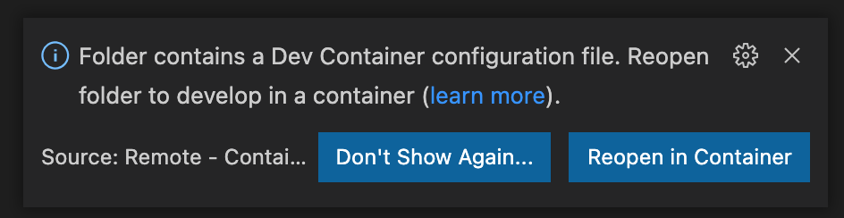

# learn-terraform-basics

## This repo contains a simple Terraform execution plan - for educational purposes only.

It will walk you through the basics of creating an AWS EC2 instance using Terraform.

### AWS Prerequisites

> This tutorial creates an AWS EC2 instance, so you must have or create:

1. AWS Account - [Sign up](https://aws.amazon.com/free)
2. AWS Credentials - [IAM](https://console.aws.amazon.com/iam/home?#/security_credentials)

> *You will need **AWS_ACCESS_KEY_ID** and **AWS_SECRET_KEY***

---
### Visual Studio Code - Remote Container Usage

> *Optional, but recommended -- [Documentation](https://code.visualstudio.com/docs/remote/containers)*

> *Note: This may seem like more trouble up front, but once you have this configured, you can run **ANY** Visual Studio Code Remote Container, which provides a Docker based development environment ensuring a consistent and reliable set of tooling needed to interact and execute the repository codebase*

Prerequisites:

1. macOS, Windows, Linux -- [System Requirements](https://code.visualstudio.com/docs/remote/containers#_system-requirements)
2. Docker - [Documentation](https://code.visualstudio.com/docs/remote/containers#_installation)
3. Visual Studio Code - [Official Site](https://code.visualstudio.com/)
4. Remote - Containers *Visual Studio Code extension* - [Marketplace](https://marketplace.visualstudio.com/items?itemName=ms-vscode-remote.remote-containers)

Usage:
1. Open Visual Studio Code on this repository
2. Copy `.devcontainer/.env-template` to `.devcontainer/.env`
3. Set the AWS_ACCESS_KEY_ID and AWS_SECRET_KEY -- see [prerequisites above](#aws-prerequisites)
4. When prompted, click 'ReOpen in Container' - 
5. Once restarted, Open a Terminal
6. [Provision](#provisioning) / [Deprovision](#deprovisioning) as documented below

### Direct usage 

> *This only applies if you are NOT using the Remote - Container configuration*

Prerequisites:

1. Install Terraform CLI - [Documentation](https://learn.hashicorp.com/tutorials/terraform/install-cli)
2. Install AWS CLI - [Documentation](https://docs.aws.amazon.com/cli/latest/userguide/install-cliv2.html)
3. AWS CLI Configuration - run `aws configure` and answer the prompts
4. Open Visual Studio Code on this repository
5. Open a Terminal
6. [Provision](#provisioning) / [Deprovision](#deprovisioning) as documented below

---
### Provisioning
> This creates a single EC2 instance, in the us-west-2 region

Initialize the Terraform working directory -- [More Info](https://www.terraform.io/docs/cli/init/index.html#initialization)
> Note: Only needs to be done once, unless there are changes to provider requirements, module sources or versions, or backend configuration

`terraform init`

Create an execution plan -- [More Info](https://www.terraform.io/docs/cli/commands/plan.html)

`terraform plan`

Provision the resources -- [More Info](https://www.terraform.io/docs/cli/commands/apply.html)

`terraform apply`

---
### Deprovisioning

Destroy all created resources -- [More Info](https://www.terraform.io/docs/cli/commands/destroy.html)

`terraform destroy`